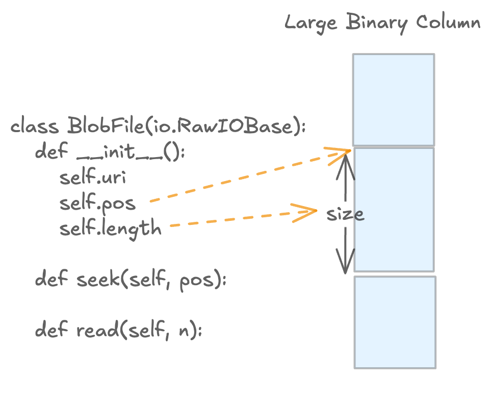

# Blob API

Lance supports storing large binary objects (blobs) alongside your data.

## Overview



Unlike other data formats, large multimodal data is a first-class
citizen in the Lance columnar format. Lance provides a high-level API to
store and retrieve large binary objects (blobs) in Lance datasets.

Lance serves large binary data using `lance.BlobFile`{.interpreted-text
role="py:class"}, which is a file-like object that lazily reads large
binary objects.

To create a Lance dataset with large blob data, you can mark a large
binary column as a blob column by adding the metadata
`lance-encoding:blob` to `true`.

```python
import pyarrow as pa

schema = pa.schema(
    [
        pa.field("id", pa.int64()),
        pa.field("video",
            pa.large_binary(),
            metadata={"lance-encoding:blob": "true"}
        ),
    ]
)
```

To fetch blobs from a Lance dataset, you can use
`lance.dataset.LanceDataset.take_blobs`{.interpreted-text
role="py:meth"}.

For example, it\'s easy to use [BlobFile]{.title-ref} to extract frames
from a video file without loading the entire video into memory.

```python
# pip install av pylance

import av
import lance

ds = lance.dataset("./youtube.lance")
start_time, end_time = 500, 1000
blobs = ds.take_blobs([5], "video")
with av.open(blobs[0]) as container:
    stream = container.streams.video[0]
    stream.codec_context.skip_frame = "NONKEY"

    start_time = start_time / stream.time_base
    start_time = start_time.as_integer_ratio()[0]
    end_time = end_time / stream.time_base
    container.seek(start_time, stream=stream)

    for frame in container.decode(stream):
        if frame.time > end_time:
            break
        display(frame.to_image())
        clear_output(wait=True)
```
